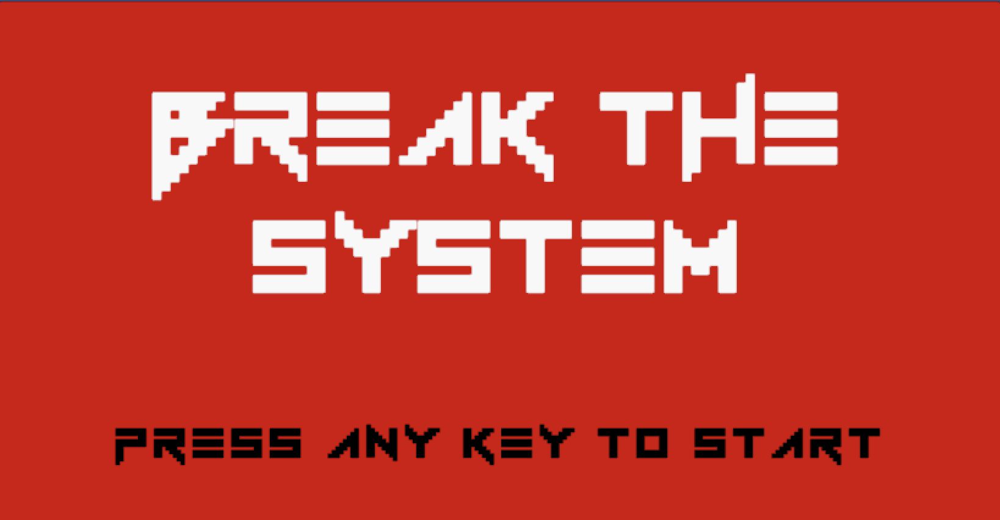

# Break the System

## Integrantes do grupo

- Arthur Barreto

- Enricco Gemha

- Rafael Katri

- Lorran Lopes

## Gameplay

[Gameplay footage here!](www.youtube.com/embed/MqMTWHRgOVE)

## Controles

No jogo, há uma tela de instruções que apresenta os controles. Há também um script que detecta se você está usando um controle ou o teclado e exibe os controles correspondentes.

### Teclado

- Setas direcionais para a esquerda e direita para movimentação.

- Tecla 'z' para pular.

- Tecla 'x' para atirar.

- Tecla 'v' para ativar o especial de fúria (dano em área).

- Para mirar nas diagonais, segure a tecla 'c' e utilize as setas direcionais.

- Tecla 'p' para pausar o jogo (da acesso a um menu de escolhas).

- Tecla 'esc' para sair da tela de pause.

### Controle de viodegame

Aviso: _Caso o controle não funcione, desplugue e plug novamente, a unity só da suporte para controle sem fio em webgl!_

- Analógico da esquerda ou setas para movimentação.

Aviso: _A partir daqui, o primeiro botão que for citado se refere aos controles de Playstation e o segundo se refere aos controles de Xbox_

- X/A para pular.

- □/X para atirar.

- R1/RB para travar a mira; junto com o analógico, mira nas diagonais.

- R3 + L3 para ativar o especial de fúria (dano em área).

- Options/Start para pausar o jogo (da acesso a um menu de escolhas).

- o/B para sair da tela de pause.

## Um pouco da história

Em um futuro banhado pelo brilho fugaz de neon, não há nada que sacie a ganância por poder.

Night City, 2045, é dominado por megacorporações e facções criminosas onde a tecnologia oferece um escape artificial de um mundo de violência e decadência.

Break the System é um run 'n' gun frenético com elementos de cyberpunk, onde você assume o papel de Break, um funcionário de uma megacorporação que pode usar diversos implantes cibernéticos.

Mergulhe em um mundo corrompido pela tecnologia e vingue-se da sua antiga empresa, a maligna corporação Geve, que ignora qualquer princípio ético para maximizar os lucros da venda de seus implantes feitos com o minério Terraneum.

Sua missão:

- Megacorporação Geve contratou uma facção para dominar a favela onde você mora assim que descobriu Terraneum na região. Vingue a sua família que foi morta pela ganância da empresa.

- Infiltre-se no jogo e lute hordas de inimigos em uma fase desafiadora.

- Aprimore suas habilidades com implantes cibernéticos que concedem poderes mortais.

- Utilize um arsenal de armas futuristas para eliminar seus oponentes.

- Enfrente um boss final épico em uma batalha eletrizante.

## Página GDD

No GDD do jogo tem-se as informações detalhadas do gamedesign do projeto, para mais informações acesse o [link](https://app.milanote.com/1RNDHx1Adz6J0G/gdd?p=j4ZgBpkaRje)

## Referências

Para programar o jogo se utilizou de ferramentas de AI como copilot, chatgpt e gemini. Além disso, também utlizamos códigos de exemplo para alguns efeitos, são eles:

- [Parallax Efect](www.youtube.com/embed/NBfhfDJOUhQ)

- [Rumble on Videogame Controller](https://forum.unity.com/threads/how-to-vibrate.760502/)

Apesar de ter sido implementada, quando compilado para WebGL não funciona, pois não há suporte, conforme dito em [post](https://docs.unity3d.com/Packages/com.unity.inputsystem@0.2/manual/SupportedDevices.html) de fórum da Unity.

## Músicas

- StartScreen -> [Sweet Child O'Mine 8-bit](www.youtube.com/embed/I6BDFFosSmU)

- Menu/Pause Screen -> [On Melancholy Hill 8-bit](www.youtube.com/embed/XWYKJFASaUY)

- Fase 1 -> [Welcome To The Jungle 8-bit](www.youtube.com/embed/bdfG4W4xpPI)

- Fase 2 -> [BYOB 8-bit](www.youtube.com/embed/VnBuJOFCvqM)

- Fase 3 -> [Master of Puppets 8-bit](www.youtube.com/embed/KU5zMmDtVXM)

- Victory Screen -> [We Are The Champions 8-bit](www.youtube.com/embed/1pB_G2ndIpY)
